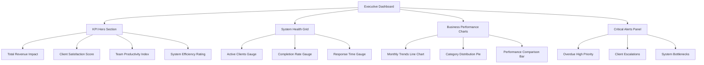
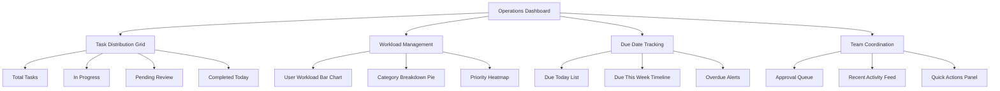
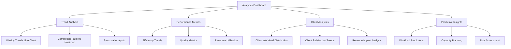
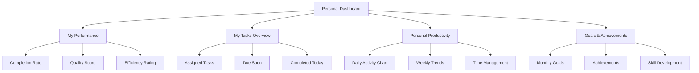

# Dashboard Rework Design

## Overview

This design outlines the comprehensive rework of the Dashboard page to transform it from a basic statistics display into a powerful analytics platform. The enhanced dashboard will leverage Apache ECharts for advanced data visualization and provide role-based insights for both executives and operational teams.

### Current State
- Basic statistics cards showing task counts
- Simple client birthday display
- Limited data visualization
- Basic role-based content filtering

### Target State
- Rich interactive dashboard with multiple chart types
- Advanced analytics and business intelligence panels
- Comprehensive performance metrics visualization
- Enhanced user experience with responsive design
- Role-based dashboard layouts (Executive, Operations, Analytics, Personal)

## Technology Stack & Dependencies

### Core Technologies
- **Vue 3** with Composition API
- **Nuxt 3** framework
- **Nuxt UI** for component library
- **Apache ECharts** via `nuxt-echarts` module
- **Pinia** for state management
- **Tailwind CSS** for styling

### New Dependencies
```json
{
  "nuxt-echarts": "^0.2.3"
}
```

### ECharts Configuration
```typescript
// nuxt.config.ts
export default defineNuxtConfig({
  modules: ['nuxt-echarts'],
  echarts: {
    charts: ['LineChart', 'BarChart', 'PieChart', 'GaugeChart', 'HeatmapChart'],
    components: [
      'DatasetComponent',
      'GridComponent', 
      'TooltipComponent',
      'LegendComponent',
      'DataZoomComponent',
      'MarkLineComponent',
      'MarkPointComponent'
    ],
    features: ['LabelLayout', 'UniversalTransition']
  }
})
```

## Component Architecture

### Component Hierarchy

```mermaid
graph TD
    A[Enhanced Dashboard] --> B[Dashboard Layout Switcher]
    A --> C[KPI Cards Section]
    A --> D[Charts Grid Section]
    A --> E[Analytics Panels Section]
    A --> F[Quick Actions Panel]
    
    B --> B1[Executive Layout]
    B --> B2[Operations Layout]
    B --> B3[Analytics Layout]
    B --> B4[Personal Layout]
    
    C --> C1[MetricCard]
    C --> C2[TrendCard]
    C --> C3[AlertCard]
    
    D --> D1[LineChartComponent]
    D --> D2[BarChartComponent]
    D --> D3[PieChartComponent]
    D --> D4[GaugeChartComponent]
    D --> D5[HeatmapComponent]
    
    E --> E1[TeamPerformancePanel]
    E --> E2[ClientInsightsPanel]
    E --> E3[ApprovalWorkflowPanel]
    E --> E4[RecentActivityPanel]
    
    F --> F1[QuickActionButton]
    F --> F2[CriticalAlerts]
```



### Core Components

#### Dashboard.vue (Enhanced)
```vue
<template>
  <div class="h-screen flex flex-col flex-1 overflow-hidden">
    <PageHeader page="Dashboard">
      <template #actions>
        <DashboardLayoutSwitcher v-model="currentLayout" />
        <DashboardRefreshButton @refresh="refreshAllData" />
      </template>
    </PageHeader>

    <main class="flex-1 overflow-y-auto p-4 bg-gray-50 dark:bg-gray-900">
      <component :is="layoutComponent" :data="dashboardData" />
    </main>
  </div>
</template>
```

#### KPI Cards Components

**MetricCard.vue**
```vue
<template>
  <UCard class="metric-card">
    <div class="flex items-center justify-between">
      <div class="flex-1">
        <p class="metric-title">{{ title }}</p>
        <div class="metric-value-container">
          <span class="metric-value">{{ formattedValue }}</span>
          <TrendIndicator v-if="trend" :trend="trend" />
        </div>
        <p v-if="subtitle" class="metric-subtitle">{{ subtitle }}</p>
      </div>
      <div :class="iconClasses">
        <UIcon :name="icon" class="w-8 h-8" />
      </div>
    </div>
  </UCard>
</template>
```

**TrendCard.vue**
```vue
<template>
  <UCard class="trend-card">
    <div class="card-header">
      <h3>{{ title }}</h3>
      <UBadge :color="trendColor">{{ trendLabel }}</UBadge>
    </div>
    <div class="mini-chart-container">
      <VChart :option="miniChartOption" :autoresize="true" style="height: 60px;" />
    </div>
  </UCard>
</template>
```

#### Chart Components

**LineChartComponent.vue**
```vue
<template>
  <UCard class="chart-container">
    <template #header>
      <div class="flex justify-between items-center">
        <h3 class="chart-title">{{ title }}</h3>
        <div class="chart-controls">
          <USelectMenu v-model="timeRange" :options="timeRangeOptions" />
          <UButton @click="exportChart" variant="ghost" size="sm">
            <UIcon name="mdi:download" />
          </UButton>
        </div>
      </div>
    </template>
    
    <div class="chart-wrapper">
      <VChart 
        ref="chartRef"
        :option="chartOption" 
        :autoresize="true" 
        :loading="isLoading"
        style="height: 400px;"
        @click="handleChartClick"
      />
    </div>
  </UCard>
</template>
```

**PieChartComponent.vue**
```vue
<template>
  <UCard class="pie-chart-container">
    <template #header>
      <h3 class="chart-title">{{ title }}</h3>
    </template>
    
    <div class="flex flex-col lg:flex-row gap-4">
      <div class="flex-1">
        <VChart 
          :option="pieChartOption" 
          :autoresize="true"
          style="height: 350px;"
          @click="handleSegmentClick"
        />
      </div>
      <div class="legend-panel">
        <div v-for="item in legendData" :key="item.name" class="legend-item">
          <div :style="{ backgroundColor: item.color }" class="legend-color"></div>
          <span class="legend-label">{{ item.display_name }}</span>
          <span class="legend-value">{{ item.count }}</span>
        </div>
      </div>
    </div>
  </UCard>
</template>
```

#### Analytics Panel Components

**TeamPerformancePanel.vue**
```vue
<template>
  <UCard class="team-performance-panel">
    <template #header>
      <h3>Team Performance</h3>
      <UButton @click="viewDetails" variant="ghost" size="sm">View Details</UButton>
    </template>
    
    <div class="performance-grid">
      <div class="performance-chart">
        <VChart :option="performanceChartOption" style="height: 300px;" />
      </div>
      
      <div class="leaderboard">
        <h4>Top Performers</h4>
        <div v-for="user in topPerformers" :key="user.id" class="performer-item">
          <UAvatar :src="user.avatar" :alt="user.fullname" size="sm" />
          <div class="performer-details">
            <span class="performer-name">{{ user.fullname }}</span>
            <span class="performer-rate">{{ user.completion_rate }}%</span>
          </div>
          <UBadge :color="getPerformanceBadgeColor(user.completion_rate)">
            {{ user.completed_tasks }}/{{ user.total_tasks }}
          </UBadge>
        </div>
      </div>
    </div>
  </UCard>
</template>
```

## Dashboard Layout Specifications

### Executive Dashboard Layout


### Operations Dashboard Layout


### Analytics Dashboard Layout


### Personal Dashboard Layout


## State Management Enhancement

### Enhanced Dashboard Store

```javascript
export const useDashboardStore = defineStore("dashboardStore", {
  state: () => ({
    // Enhanced statistics from API
    enhancedStats: null,
    
    // Chart data
    weeklyTrends: [],
    categoryDistribution: {},
    statusBreakdown: {},
    priorityBreakdown: {},
    
    // Performance metrics
    performanceMetrics: {},
    teamAnalytics: {},
    clientInsights: {},
    businessIntelligence: {},
    
    // UI state
    currentLayout: 'operations', // executive, operations, analytics, personal
    selectedTimeRange: '7d',
    chartLoadingStates: {},
    
    // Real-time data
    realtimeEnabled: false,
    lastUpdated: null,
  }),
  
  getters: {
    // KPI Calculations
    overallCompletionRate: (state) => state.performanceMetrics?.overall_completion_rate || 0,
    workloadBalanceScore: (state) => state.performanceMetrics?.workload_balance_score || 0,
    systemHealthStatus: (state) => state.businessIntelligence?.system_health?.system_load_indicator || 'unknown',
    
    // Chart data getters
    weeklyTrendsChartData: (state) => {
      return {
        xAxis: state.weeklyTrends.map(week => week.week_label),
        completed: state.weeklyTrends.map(week => week.completed),
        created: state.weeklyTrends.map(week => week.created)
      };
    },
    
    categoryDistributionChartData: (state) => {
      return Object.entries(state.categoryDistribution).map(([key, value]) => ({
        name: value.display_name,
        value: value.count
      }));
    },
    
    // Team performance calculations
    topPerformers: (state) => {
      return state.teamAnalytics?.user_performance
        ?.sort((a, b) => b.completion_rate - a.completion_rate)
        ?.slice(0, 5) || [];
    },
    
    // Critical alerts
    criticalAlerts: (state) => {
      const alerts = [];
      
      if (state.enhancedStats?.summary?.overdue > 0) {
        alerts.push({
          type: 'error',
          title: 'Overdue Tasks',
          message: `${state.enhancedStats.summary.overdue} tasks are overdue`,
          action: 'View Tasks'
        });
      }
      
      return alerts;
    }
  },
  
  actions: {
    async fetchEnhancedDashboardData() {
      try {
        this.setChartLoading('all', true);
        const { $apiFetch } = useNuxtApp();
        
        const response = await $apiFetch('/api/tasks/statistics/');
        
        this.enhancedStats = response;
        this.weeklyTrends = response.charts_data?.weekly_trends || [];
        this.categoryDistribution = response.charts_data?.category_distribution || {};
        this.statusBreakdown = response.charts_data?.status_breakdown || {};
        this.priorityBreakdown = response.charts_data?.priority_breakdown || {};
        this.performanceMetrics = response.performance_metrics || {};
        this.teamAnalytics = response.team_analytics || {};
        this.clientInsights = response.client_insights || {};
        this.businessIntelligence = response.business_intelligence || {};
        
        this.lastUpdated = new Date();
        
      } catch (error) {
        console.error('Failed to fetch enhanced dashboard data:', error);
        throw error;
      } finally {
        this.setChartLoading('all', false);
      }
    },
    
    setChartLoading(chartId, loading) {
      if (chartId === 'all') {
        Object.keys(this.chartLoadingStates).forEach(key => {
          this.chartLoadingStates[key] = loading;
        });
      } else {
        this.chartLoadingStates[chartId] = loading;
      }
    },
    
    switchLayout(layout) {
      this.currentLayout = layout;
    },
    
    updateTimeRange(range) {
      this.selectedTimeRange = range;
      // Trigger data refresh with new time range
      this.fetchEnhancedDashboardData();
    }
  }
});
```

## Chart Configuration Specifications

### Weekly Trends Line Chart
```javascript
const weeklyTrendsOption = computed(() => ({
  title: {
    text: 'Weekly Task Trends',
    left: 'center'
  },
  tooltip: {
    trigger: 'axis',
    axisPointer: {
      type: 'cross'
    }
  },
  legend: {
    data: ['Created', 'Completed'],
    bottom: 0
  },
  xAxis: {
    type: 'category',
    data: dashboardStore.weeklyTrendsChartData.xAxis
  },
  yAxis: {
    type: 'value'
  },
  series: [
    {
      name: 'Created',
      type: 'line',
      data: dashboardStore.weeklyTrendsChartData.created,
      smooth: true,
      itemStyle: { color: '#3B82F6' }
    },
    {
      name: 'Completed',
      type: 'line',
      data: dashboardStore.weeklyTrendsChartData.completed,
      smooth: true,
      itemStyle: { color: '#10B981' }
    }
  ]
}));
```

### Category Distribution Pie Chart
```javascript
const categoryPieOption = computed(() => ({
  title: {
    text: 'Task Distribution by Category',
    left: 'center'
  },
  tooltip: {
    trigger: 'item',
    formatter: '{a} <br/>{b}: {c} ({d}%)'
  },
  legend: {
    orient: 'vertical',
    left: 'left'
  },
  series: [
    {
      name: 'Categories',
      type: 'pie',
      radius: ['50%', '70%'],
      data: dashboardStore.categoryDistributionChartData,
      emphasis: {
        itemStyle: {
          shadowBlur: 10,
          shadowOffsetX: 0,
          shadowColor: 'rgba(0, 0, 0, 0.5)'
        }
      }
    }
  ]
}));
```

### Performance Gauge Chart
```javascript
const performanceGaugeOption = computed(() => ({
  series: [
    {
      name: 'Completion Rate',
      type: 'gauge',
      startAngle: 180,
      endAngle: 0,
      center: ['50%', '75%'],
      radius: '90%',
      min: 0,
      max: 100,
      splitNumber: 8,
      axisLine: {
        lineStyle: {
          width: 6,
          color: [
            [0.25, '#FF6B6B'],
            [0.5, '#FFE66D'],
            [0.75, '#4ECDC4'],
            [1, '#45B7D1']
          ]
        }
      },
      pointer: {
        icon: 'path://M12.8,0.7l12,40.1H0.7L12.8,0.7z',
        length: '12%',
        width: 20,
        offsetCenter: [0, '-60%'],
        itemStyle: {
          color: 'auto'
        }
      },
      axisTick: {
        length: 12,
        lineStyle: {
          color: 'auto',
          width: 2
        }
      },
      splitLine: {
        length: 20,
        lineStyle: {
          color: 'auto',
          width: 5
        }
      },
      axisLabel: {
        color: '#464646',
        fontSize: 20,
        distance: -60,
        rotate: 'tangential',
        formatter: function (value) {
          if (value === 87.5) {
            return 'A+';
          } else if (value === 62.5) {
            return 'A';
          } else if (value === 37.5) {
            return 'B';
          } else if (value === 12.5) {
            return 'C';
          }
          return '';
        }
      },
      title: {
        offsetCenter: [0, '-10%'],
        fontSize: 20
      },
      detail: {
        fontSize: 30,
        offsetCenter: [0, '-35%'],
        valueAnimation: true,
        formatter: function (value) {
          return Math.round(value) + '%';
        },
        color: 'inherit'
      },
      data: [
        {
          value: dashboardStore.overallCompletionRate,
          name: 'Completion Rate'
        }
      ]
    }
  ]
}));
```

## Responsive Design Strategy

### Breakpoint System
```css
/* Mobile First Approach */
.dashboard-grid {
  @apply grid grid-cols-1 gap-4;
}

/* Tablet */
@screen md {
  .dashboard-grid {
    @apply grid-cols-2;
  }
}

/* Desktop */
@screen lg {
  .dashboard-grid {
    @apply grid-cols-3;
  }
}

/* Large Desktop */
@screen xl {
  .dashboard-grid {
    @apply grid-cols-4;
  }
}
```

### Chart Responsiveness
```javascript
// Chart resize handling
const chartRef = ref(null);

onMounted(() => {
  const resizeObserver = new ResizeObserver(() => {
    if (chartRef.value) {
      chartRef.value.resize();
    }
  });
  
  resizeObserver.observe(chartRef.value.$el);
  
  onUnmounted(() => {
    resizeObserver.disconnect();
  });
});
```

## API Integration Enhancement

### Enhanced Task Service
```javascript
export const useTaskService = () => {
  const { $apiFetch } = useNuxtApp();

  const getEnhancedStatistics = async (timeRange = '7d') => {
    return await $apiFetch('/api/tasks/statistics/', {
      method: 'GET',
      query: { timeRange }
    });
  };

  const getCustomAnalytics = async (filters = {}) => {
    return await $apiFetch('/api/analytics/custom/', {
      method: 'POST',
      body: filters
    });
  };

  const exportDashboardData = async (format = 'pdf') => {
    return await $apiFetch('/api/dashboard/export/', {
      method: 'POST',
      body: { format },
      responseType: 'blob'
    });
  };

  return {
    getEnhancedStatistics,
    getCustomAnalytics,
    exportDashboardData
  };
};
```

## Real-time Updates Implementation

### WebSocket Integration
```javascript
// composables/useDashboardRealtime.js
export const useDashboardRealtime = () => {
  const dashboardStore = useDashboardStore();
  const socket = ref(null);
  const isConnected = ref(false);

  const connect = () => {
    socket.value = new WebSocket(`${location.protocol === 'https:' ? 'wss:' : 'ws:'}//${location.host}/ws/dashboard/`);
    
    socket.value.onopen = () => {
      isConnected.value = true;
      console.log('Dashboard WebSocket connected');
    };
    
    socket.value.onmessage = (event) => {
      const data = JSON.parse(event.data);
      handleRealtimeUpdate(data);
    };
    
    socket.value.onclose = () => {
      isConnected.value = false;
      // Reconnect after 5 seconds
      setTimeout(connect, 5000);
    };
  };

  const handleRealtimeUpdate = (data) => {
    switch (data.type) {
      case 'task_completed':
        dashboardStore.incrementCompletedTasks();
        break;
      case 'task_created':
        dashboardStore.incrementTotalTasks();
        break;
      case 'stats_updated':
        dashboardStore.updatePartialStats(data.payload);
        break;
    }
  };

  return {
    connect,
    isConnected: readonly(isConnected)
  };
};
```

## Testing Strategy

### Unit Testing
```javascript
// tests/components/Dashboard.test.js
import { describe, it, expect, vi } from 'vitest';
import { mount } from '@vue/test-utils';
import Dashboard from '~/components/dashboard/Dashboard.vue';

describe('Enhanced Dashboard', () => {
  it('renders executive layout correctly', async () => {
    const wrapper = mount(Dashboard, {
      global: {
        plugins: [createTestingPinia()]
      }
    });
    
    // Test layout switching
    await wrapper.vm.switchLayout('executive');
    expect(wrapper.find('.executive-layout').exists()).toBe(true);
  });

  it('handles chart interactions correctly', async () => {
    const wrapper = mount(Dashboard);
    const chartComponent = wrapper.findComponent({ name: 'LineChartComponent' });
    
    await chartComponent.vm.$emit('chart-click', { seriesIndex: 0, dataIndex: 1 });
    // Assert navigation or modal opening
  });
});
```

### Chart Testing
```javascript
// tests/charts/LineChart.test.js
describe('LineChartComponent', () => {
  it('generates correct chart options', () => {
    const mockData = {
      xAxis: ['Week 1', 'Week 2'],
      completed: [10, 15],
      created: [12, 18]
    };
    
    const wrapper = mount(LineChartComponent, {
      props: { data: mockData }
    });
    
    const chartOptions = wrapper.vm.chartOption;
    expect(chartOptions.series).toHaveLength(2);
    expect(chartOptions.series[0].data).toEqual([10, 15]);
  });
});
```