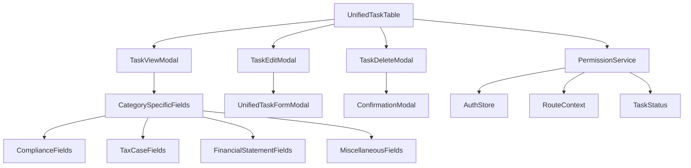
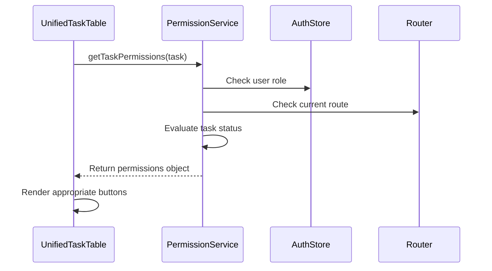
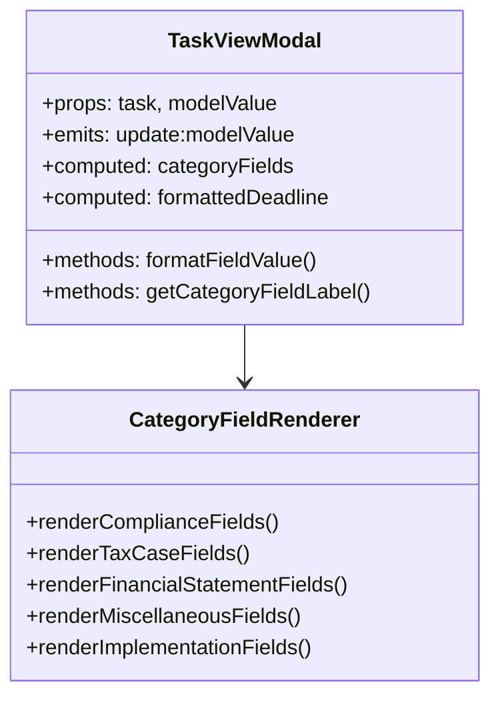
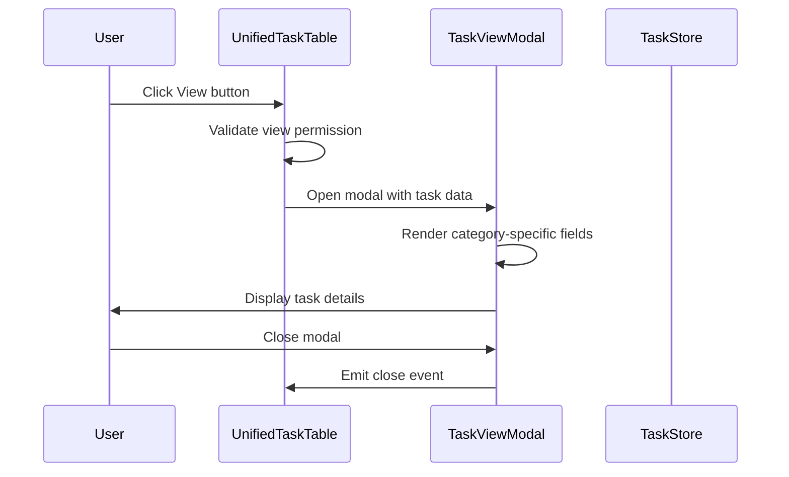
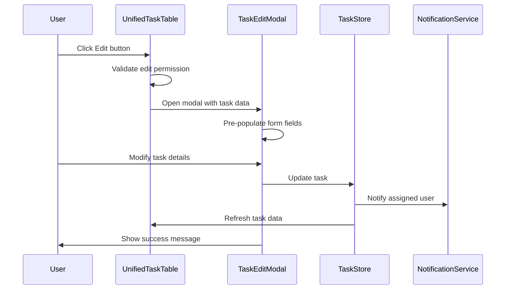
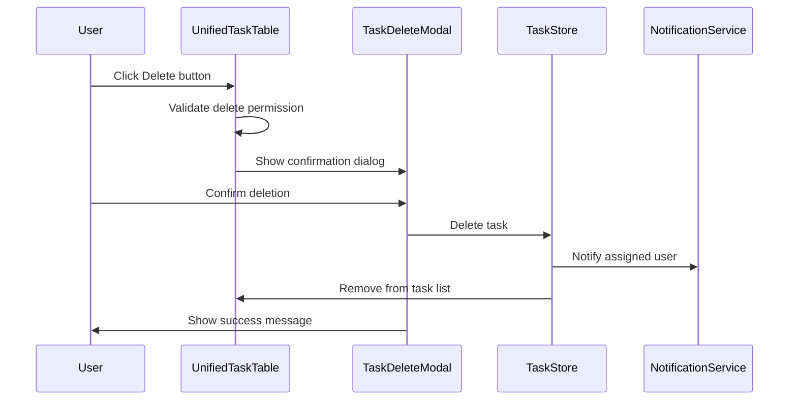

# Task Actions and Permissions System Design

## Overview

This document outlines the design for implementing a comprehensive task actions and permissions system for the UnifiedTaskTable component. The system will provide role-based access controls and context-aware action buttons that behave differently based on the current route (/my-tasks vs /tasks) and task status.

## Technology Stack & Dependencies

- **Frontend Framework**: Nuxt 3 with Vue 3 Composition API
- **UI Components**: Nuxt UI v3+ with UModal implementation standards
- **State Management**: Pinia stores (auth, tasks, users)
- **Validation**: Vee-validate with Zod schemas
- **Routing**: Nuxt file-based routing with middleware protection

## Component Architecture

### Core Components



### Permission Matrix

| Route | User Role | Task Status | View | Edit | Delete |
|-------|-----------|-------------|------|------|--------|
| /my-tasks | Regular User | Any | ✅ | ❌ | ❌ |
| /my-tasks | Admin User | Any | ✅ | ❌ | ❌ |
| /tasks | Admin User | not_yet_started | ✅ | ✅ | ✅ |
| /tasks | Admin User | Other statuses | ✅ | ❌ | ❌ |

## Permission Logic Implementation

### Permission Service

```javascript
// composables/useTaskPermissions.js
export const useTaskPermissions = () => {
  const authStore = useAuthStore()
  const route = useRoute()
  
  const getTaskPermissions = (task) => {
    const isMyTasksRoute = route.path === '/my-tasks'
    const isTasksRoute = route.path === '/tasks'
    const isAdmin = authStore.isAdmin
    const isNotYetStarted = task.status === 'not_yet_started'
    
    return {
      canView: true, // Everyone can view
      canEdit: isTasksRoute && isAdmin && isNotYetStarted,
      canDelete: isTasksRoute && isAdmin && isNotYetStarted
    }
  }
  
  return { getTaskPermissions }
}
```

### Conditional Action Buttons



## Modal Component Specifications

### 1. TaskViewModal Component

**Purpose**: Display comprehensive task details in read-only format

**Features**:
- Category-specific field display
- Responsive layout with proper spacing
- Status and priority badges
- Assignment information
- Deadline visualization with days remaining



### 2. TaskEditModal Component

**Purpose**: Allow authorized users to modify task details

**Features**:
- Reuses UnifiedTaskFormModal in edit mode
- Pre-populates with existing task data
- Category-specific validation
- Notification system for assigned users

### 3. TaskDeleteModal Component

**Purpose**: Confirm task deletion with appropriate warnings

**Features**:
- Confirmation dialog with task details
- Warning about assigned user notification
- Irreversible action warning
- Loading states during deletion

## Task Detail Fields by Category

### Base Fields (All Categories)
- **Client**: Client name and details
- **Description**: Task description
- **Category**: Task category with proper labeling
- **Status**: Current status with badge
- **Priority**: Priority level with badge
- **Assigned To**: Assignee name
- **Deadline**: Due date with days remaining calculation
- **Created**: Creation timestamp
- **Updated**: Last modification timestamp

### Category-Specific Fields

#### Compliance Tasks
- **Steps**: Required compliance steps
- **Requirements**: Compliance requirements
- **Period Covered**: Coverage period
- **Engagement Date**: Engagement date

#### Financial Statement Tasks
- **Type**: Statement type (Quarterly/Annual)
- **Needed Data**: Required data for preparation
- **Period Covered**: Financial period
- **Engagement Date**: Engagement date

#### Tax Case Tasks
- **Tax Category**: One-Time Engagement/Regular Process
- **Tax Type**: Percentage Tax/Income Tax/Withholding Tax
- **Form**: BIR form type
- **Working Paper**: Working paper details
- **Tax Payable**: Tax amount (formatted currency)
- **Last Follow-up**: Last follow-up date
- **Period Covered**: Tax period
- **Engagement Date**: Engagement date

#### Miscellaneous Tasks
- **Area**: Task area/domain
- **Period Covered**: Coverage period
- **Engagement Date**: Engagement date

#### Implementation Tasks (Finance/HR/Accounting Audit)
- **Period Covered**: Implementation period
- **Engagement Date**: Engagement date

## Data Flow Architecture

### View Action Flow



### Edit Action Flow



### Delete Action Flow



## Notification System Integration

### Notification Types

1. **Task Edited**: Sent to assigned user when task is modified
2. **Task Deleted**: Sent to assigned user when task is removed
3. **Assignment Changed**: Sent when task is reassigned

### Notification Payload Structure

```javascript
{
  type: 'task_edited' | 'task_deleted' | 'assignment_changed',
  task_id: number,
  task_description: string,
  client_name: string,
  modified_by: {
    id: number,
    fullname: string
  },
  changes: {
    field: 'old_value -> new_value'
  },
  timestamp: string
}
```

## API Integration Requirements

### View Task Details Endpoint
- **GET** `/api/tasks/{id}/`
- Returns complete task object with all category-specific fields
- Includes related data (client details, assignee info)

### Update Task Endpoint
- **PUT** `/api/tasks/{id}/`
- Accepts partial updates
- Validates category-specific fields
- Triggers notification to assigned user

### Delete Task Endpoint
- **DELETE** `/api/tasks/{id}/`
- Soft delete with audit trail
- Triggers notification to assigned user
- Returns confirmation response

## State Management Patterns

### Task Store Enhancements

```javascript
// stores/tasks.js
export const useTaskStore = defineStore('tasks', {
  state: () => ({
    selectedTask: null,
    showViewModal: false,
    showEditModal: false,
    showDeleteModal: false
  }),
  
  actions: {
    async viewTask(taskId) {
      const task = await this.fetchTaskById(taskId)
      this.selectedTask = task
      this.showViewModal = true
    },
    
    async editTask(taskId) {
      const task = await this.fetchTaskById(taskId)
      this.selectedTask = task
      this.showEditModal = true
    },
    
    async deleteTask(taskId) {
      this.selectedTask = this.tasks.find(t => t.id === taskId)
      this.showDeleteModal = true
    }
  }
})
```

## Field Display Utilities

### Field Formatting Functions

```javascript
// utils/taskFieldFormatters.js
export const formatTaskField = (fieldName, value, category) => {
  switch (fieldName) {
    case 'tax_payable':
      return new Intl.NumberFormat('en-PH', {
        style: 'currency',
        currency: 'PHP'
      }).format(value)
    
    case 'deadline':
    case 'engagement_date':
    case 'last_followup':
      return formatDate(value)
    
    case 'priority':
      return priorityChoices.find(p => p.value === value)?.label || value
    
    case 'status':
      return statusChoices.find(s => s.value === value)?.label || value
    
    default:
      return value || 'Not specified'
  }
}
```

### Category Field Configurations

```javascript
// utils/categoryFieldConfig.js
export const getCategoryFieldConfig = (category) => {
  const baseFields = [
    { key: 'client_name', label: 'Client', type: 'text' },
    { key: 'description', label: 'Description', type: 'textarea' },
    { key: 'status', label: 'Status', type: 'badge' },
    { key: 'priority', label: 'Priority', type: 'badge' },
    { key: 'assigned_to_name', label: 'Assigned To', type: 'text' },
    { key: 'deadline', label: 'Deadline', type: 'date' }
  ]
  
  const categorySpecificFields = CATEGORY_FIELDS[category]?.fields.map(field => ({
    key: field,
    label: getFieldLabel(field),
    type: getFieldType(field)
  })) || []
  
  return [...baseFields, ...categorySpecificFields]
}
```

## Testing Strategy

### Unit Testing
- **Permission Logic**: Test all permission combinations
- **Field Rendering**: Test category-specific field display
- **Modal Interactions**: Test modal open/close behaviors
- **API Integration**: Mock API calls and test responses

### Integration Testing
- **Route Context**: Test behavior differences between routes
- **User Roles**: Test admin vs regular user permissions
- **Task Status**: Test status-based permission changes
- **Notification Flow**: Test notification triggering

### E2E Testing Scenarios
1. **View Task from My Tasks**: User clicks view, modal opens with correct data
2. **Edit Task as Admin**: Admin edits task, assigned user receives notification
3. **Delete Task Confirmation**: Admin deletes task with proper confirmation flow
4. **Permission Denied**: Regular user cannot edit/delete tasks

## Implementation Phases

### Phase 1: Core Infrastructure
- Implement permission service
- Create base modal components
- Set up state management patterns

### Phase 2: View Functionality
- Implement TaskViewModal
- Add category-specific field rendering
- Integrate with existing UnifiedTaskTable

### Phase 3: Edit Functionality
- Integrate with UnifiedTaskFormModal
- Add pre-population logic
- Implement notification system

### Phase 4: Delete Functionality
- Create confirmation modal
- Implement soft delete logic
- Add audit trail support

### Phase 5: Testing & Refinement
- Comprehensive testing
- Performance optimization
- User experience refinements