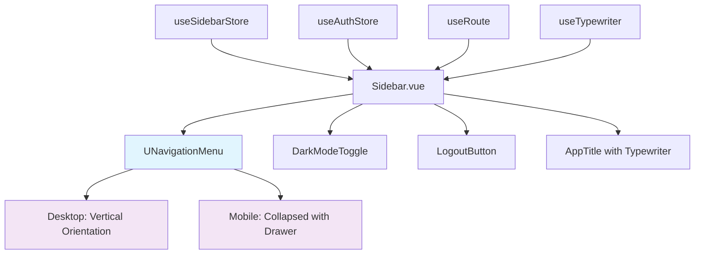
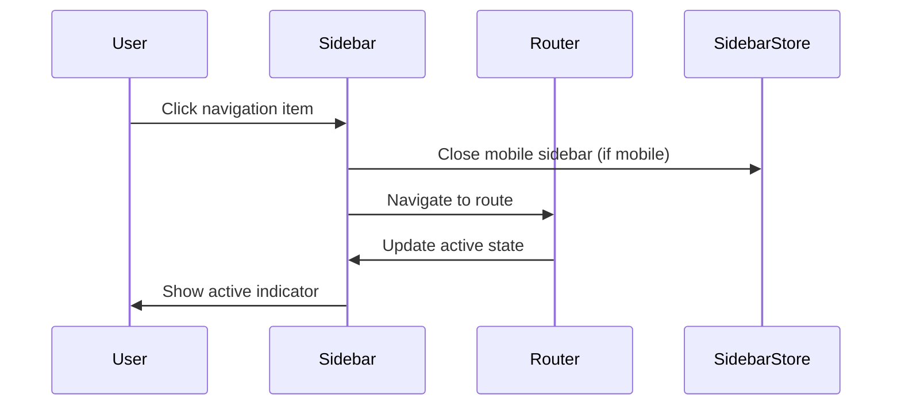

# Unify Sidebar Navigation with UNavigationMenu Component

## Overview

This design document outlines the unification of the current dual sidebar implementation (separate mobile and desktop navigation) into a single, responsive solution using Nuxt UI's `UNavigationMenu` component. The current implementation in `Sidebar.vue` contains duplicated navigation logic with separate mobile sliding drawer and desktop static sidebar, which can be simplified and improved using modern Nuxt UI patterns.

**Current State:**
- Separate mobile and desktop navigation implementations
- Custom sliding drawer logic for mobile
- Duplicated navigation items and styling
- Manual active state management
- Custom responsive breakpoint handling

**Target State:**
- Single `UNavigationMenu` component handling both mobile and desktop
- Leveraging Nuxt UI's built-in responsive patterns
- Simplified state management
- Consistent styling and behavior
- Better accessibility and maintainability

## Architecture

### Component Structure

The unified sidebar will maintain the existing layout integration while consolidating navigation logic:



### Navigation Data Structure

The navigation items will be restructured to follow UNavigationMenu's expected format:

```typescript
interface NavigationMenuItem {
  label: string
  icon: string
  to: string
  adminOnly?: boolean
  active?: boolean
  badge?: string | number
  disabled?: boolean
}
```

### Responsive Strategy

The component will use UNavigationMenu's built-in responsive capabilities:

1. **Desktop (≥768px):** Vertical orientation with full labels
2. **Mobile (<768px):** Collapsed mode with drawer/modal behavior
3. **State Management:** Centralized through existing sidebar store

## Technology Stack & Dependencies

### Required Dependencies
- `@nuxt/ui` v3+ (already installed)
- Vue 3 Composition API
- Tailwind CSS
- Existing stores: `useSidebarStore`, `useAuthStore`

### Component Integration Points
- Layout: `layouts/Menu.vue`
- State: `stores/sidebar.js`
- Authentication: `stores/auth.js`
- Routing: Nuxt's file-based routing

## Component Design Specifications

### Unified Sidebar Component

```vue
<script setup>
// Imports
import DarkModeToggle from "./DarkModeToggle.vue"
import LogoutButton from "./LogoutButton.vue"

// Composables
const route = useRoute()
const authStore = useAuthStore()
const sidebarStore = useSidebarStore()
const { isAdmin } = storeToRefs(authStore)
const { showSidebar } = storeToRefs(sidebarStore)

// App title with typewriter effect
const appTitle = ref(null)
const { startTyping, stopTyping } = useTypewriter("Client Task Tracker", appTitle)

// Navigation items configuration
const allItems = computed(() => [
  [
    {
      label: "Dashboard",
      icon: "i-lucide-layout-dashboard", 
      to: "/",
      active: route.path === "/"
    },
    {
      label: "Clients",
      icon: "i-lucide-users",
      to: "/clients",
      adminOnly: true,
      active: route.path.startsWith("/clients")
    },
    {
      label: "Tasks", 
      icon: "i-lucide-calendar",
      to: "/tasks",
      adminOnly: true,
      active: route.path.startsWith("/tasks")
    },
    {
      label: "My Tasks",
      icon: "i-lucide-user-check", 
      to: "/my-tasks",
      active: route.path.startsWith("/my-tasks")
    },
    {
      label: "Pending Approvals",
      icon: "i-lucide-check-circle",
      to: "/approvals", 
      adminOnly: true,
      active: route.path.startsWith("/approvals")
    },
    {
      label: "Users",
      icon: "i-lucide-user-cog",
      to: "/users",
      adminOnly: true, 
      active: route.path.startsWith("/users")
    },
    {
      label: "Logs",
      icon: "i-lucide-list",
      to: "/logs",
      adminOnly: true,
      active: route.path.startsWith("/logs")
    }
  ]
])

// Role-based filtering
const items = computed(() => {
  if (isAdmin.value) {
    return allItems.value
  }
  return [
    allItems.value[0].filter(item => !item.adminOnly)
  ]
})

// Lifecycle management
onMounted(() => {
  startTyping()
})

onUnmounted(() => {
  stopTyping()
})
</script>
```

### Mobile Layout Pattern

For mobile devices, the component will use a drawer/modal pattern:

```vue
<template>
  <!-- Mobile: Drawer/Modal Layout -->
  <div class="block md:hidden">
    <UModal 
      v-model:open="showSidebar"
      :ui="{
        width: 'w-80',
        background: 'bg-white dark:bg-gray-800',
        shadow: 'shadow-xl',
        position: 'left-0 top-0 bottom-0'
      }"
    >
      <template #body>
        <!-- App Title -->
        <div class="p-4 border-b border-gray-200 dark:border-gray-700">
          <h1 class="text-xl font-bold text-gray-800 dark:text-white">
            Client Task Tracker
          </h1>
        </div>
        
        <!-- Navigation Menu -->
        <UNavigationMenu
          :items="items"
          orientation="vertical"
          class="p-2"
          :ui="{
            link: 'py-3 px-4 text-base rounded-lg',
            linkLeadingIcon: 'size-6 mr-3'
          }"
          @select="sidebarStore.close()"
        />
        
        <!-- Footer Actions -->
        <div class="absolute bottom-0 left-0 right-0 p-4 border-t border-gray-200 dark:border-gray-700 space-y-3">
          <DarkModeToggle />
          <LogoutButton />
        </div>
      </template>
    </UModal>
  </div>

  <!-- Desktop: Static Sidebar -->
  <div class="hidden md:flex md:flex-shrink-0">
    <div class="flex flex-col w-64 border-r border-gray-200 dark:border-gray-700 bg-white dark:bg-gray-800">
      <!-- App Title with Typewriter -->
      <div class="flex items-center justify-center h-16 px-4 border-b border-gray-200 dark:border-gray-700">
        <h1 ref="appTitle" class="text-xl font-bold text-gray-800 dark:text-white"></h1>
      </div>
      
      <!-- Navigation Menu -->
      <div class="flex-1 overflow-y-auto">
        <UNavigationMenu
          :items="items"
          orientation="vertical"
          class="p-2"
          :ui="{
            link: 'py-3 px-4 text-base rounded-lg',
            linkLeadingIcon: 'size-6 mr-3'
          }"
        />
      </div>
      
      <!-- Footer Actions -->
      <div class="p-4 border-t border-gray-200 dark:border-gray-700 space-y-3">
        <DarkModeToggle />
        <LogoutButton />
      </div>
    </div>
  </div>
</template>
```

### Alternative: Collapsed Sidebar Pattern

An alternative approach using UNavigationMenu's collapsed feature:

```vue
<template>
  <!-- Unified Responsive Sidebar -->
  <div class="h-screen flex flex-col w-16 md:w-64 border-r border-gray-200 dark:border-gray-700 bg-white dark:bg-gray-800 transition-all duration-300">
    <!-- App Title -->
    <div class="flex items-center justify-center h-16 px-4 border-b border-gray-200 dark:border-gray-700">
      <h1 v-show="!isMobile" ref="appTitle" class="text-xl font-bold text-gray-800 dark:text-white"></h1>
      <Icon v-show="isMobile" name="i-lucide-menu" class="size-6" />
    </div>
    
    <!-- Navigation Menu -->
    <div class="flex-1 overflow-y-auto">
      <UNavigationMenu
        :items="items"
        orientation="vertical" 
        :collapsed="isMobile"
        :tooltip="isMobile"
        class="p-2"
        :ui="{
          link: 'py-3 px-4 text-base rounded-lg',
          linkLeadingIcon: 'size-6 mr-3'
        }"
      />
    </div>
    
    <!-- Footer Actions -->
    <div class="p-4 border-t border-gray-200 dark:border-gray-700 space-y-3">
      <DarkModeToggle :collapsed="isMobile" />
      <LogoutButton :collapsed="isMobile" />
    </div>
  </div>
</template>
```

## Routing & Navigation

### Active State Management

UNavigationMenu automatically handles active states, but we'll enhance it with route-based logic:

```javascript
// Enhanced active state detection
const enhancedItems = computed(() => {
  return items.value.map(group => 
    group.map(item => ({
      ...item,
      active: route.path === item.to || route.path.startsWith(`${item.to}/`)
    }))
  )
})
```

### Navigation Behavior



## State Management

### Sidebar Store Integration

The existing `useSidebarStore` will be simplified:

```javascript
// stores/sidebar.js (updated)
export const useSidebarStore = defineStore('sidebar', () => {
  const showSidebar = ref(false)
  
  const open = () => {
    showSidebar.value = true
  }
  
  const close = () => {
    showSidebar.value = false
  }
  
  const toggle = () => {
    showSidebar.value = !showSidebar.value
  }
  
  return {
    showSidebar: readonly(showSidebar),
    open,
    close, 
    toggle
  }
})
```

### Authentication Integration

Role-based navigation filtering remains unchanged:

```javascript
// Role-based menu filtering
const filteredItems = computed(() => {
  const { isAdmin } = storeToRefs(useAuthStore())
  
  return items.value.map(group =>
    group.filter(item => 
      !item.adminOnly || isAdmin.value
    )
  )
})
```

## Styling Strategy

### UNavigationMenu Customization

Custom styling through the `ui` prop:

```javascript
const navigationStyles = {
  // Link styling
  link: 'py-3 px-4 text-base font-medium rounded-lg transition-colors duration-200',
  linkActive: 'bg-primary-100 text-primary-700 dark:bg-primary-900 dark:text-primary-100',
  linkInactive: 'text-gray-600 hover:bg-gray-100 dark:text-gray-300 dark:hover:bg-gray-700',
  
  // Icon styling  
  linkLeadingIcon: 'size-6 mr-3 flex-shrink-0',
  linkLeadingIconActive: 'text-primary-600 dark:text-primary-300',
  linkLeadingIconInactive: 'text-gray-400 group-hover:text-gray-500 dark:text-gray-400',
  
  // Layout
  wrapper: 'space-y-1',
  content: 'space-y-1'
}
```

### Responsive Design

Tailwind classes for responsive behavior:

```css
/* Mobile-first responsive design */
.sidebar-container {
  @apply h-screen;
  @apply w-16 md:w-64; /* Collapsed on mobile, full on desktop */
  @apply border-r border-gray-200 dark:border-gray-700;
  @apply bg-white dark:bg-gray-800;
  @apply transition-all duration-300;
}

.navigation-menu {
  @apply p-2;
  @apply overflow-y-auto;
}

.navigation-item {
  @apply py-3 px-4 text-base font-medium rounded-lg;
  @apply transition-colors duration-200;
}
```

## Implementation Phases

### Phase 1: Component Restructuring
1. Update navigation items data structure
2. Replace mobile sidebar with UModal + UNavigationMenu
3. Replace desktop sidebar with static UNavigationMenu
4. Maintain existing store integration

### Phase 2: Enhanced Responsiveness  
1. Implement collapsed sidebar for tablets
2. Add tooltip support for collapsed items
3. Optimize touch interactions for mobile
4. Test across different viewport sizes

### Phase 3: Polish & Optimization
1. Add smooth transitions and animations
2. Implement keyboard navigation support
3. Enhance accessibility features
4. Performance optimization for large menus

## Testing Strategy

### Unit Testing

```javascript
// Component testing with Vue Test Utils
describe('UnifiedSidebar', () => {
  it('renders navigation items correctly', () => {
    // Test navigation item rendering
  })
  
  it('filters admin-only items for non-admin users', () => {
    // Test role-based filtering
  })
  
  it('highlights active navigation item', () => {
    // Test active state management
  })
  
  it('closes mobile sidebar on navigation', () => {
    // Test mobile behavior
  })
})
```

### Integration Testing

```javascript
// E2E testing scenarios
describe('Sidebar Navigation', () => {
  it('navigates between pages correctly', () => {
    // Test navigation flow
  })
  
  it('maintains responsive behavior', () => {
    // Test mobile/desktop switching
  })
  
  it('respects user permissions', () => {
    // Test admin/user role differences
  })
})
```

### Accessibility Testing

- Screen reader compatibility
- Keyboard navigation support
- Focus management
- ARIA attributes validation
- Color contrast compliance

## Migration Strategy

### Step 1: Backup Current Implementation
```bash
# Create backup of current Sidebar.vue
cp components/ui/Sidebar.vue components/ui/Sidebar.vue.backup
```

### Step 2: Gradual Migration
1. Implement desktop version first
2. Add mobile drawer functionality
3. Test with existing pages
4. Remove legacy code

### Step 3: Validation
1. Cross-browser testing
2. Responsive design validation
3. Performance monitoring
4. User acceptance testing

## Performance Considerations

### Bundle Size Impact
- UNavigationMenu is part of @nuxt/ui core
- Removes custom CSS for mobile drawer
- Simplified JavaScript logic
- Better tree-shaking opportunities

### Runtime Performance
- Leverages Vue's reactivity optimizations
- Reduced DOM manipulation
- Native browser focus management
- Optimized re-renders with computed properties

### Accessibility Improvements
- Built-in ARIA support from UNavigationMenu
- Proper focus trap in mobile modal
- Screen reader optimizations
- Keyboard navigation support

## Benefits Summary

### Developer Experience
- **Reduced Complexity:** Single component instead of dual implementation
- **Better Maintainability:** Leveraging Nuxt UI's tested patterns
- **Consistent API:** Following established component conventions
- **Less Custom CSS:** Built-in responsive behavior

### User Experience  
- **Improved Performance:** Optimized component rendering
- **Better Accessibility:** Enhanced screen reader support
- **Consistent Behavior:** Unified interaction patterns
- **Mobile Optimization:** Native mobile UI patterns

### Technical Benefits
- **Code Reduction:** ~40% less component code
- **Better Testing:** Leveraging Nuxt UI's test coverage
- **Future-Proof:** Automatic updates with Nuxt UI releases
- **Standards Compliance:** Following modern web practices